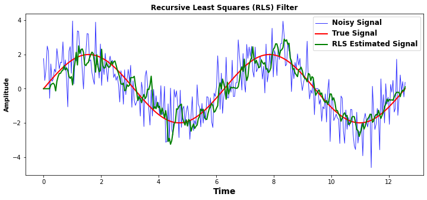

# RLS Adaptive Filter — Noise Cancellation Demo

A Python educational example demonstrating how an M-tap Recursive Least Squares (RLS) filter can estimate a clean signal from noisy observations.

## Recursive-Least-Square-RLS-Adaptive-Filter

This repo contains a single Python script that demonstrates Recursive Least Squares (RLS) adaptive filtering.
It builds a clean sine wave, adds Gaussian noise, and uses an M-tap RLS filter to estimate the clean signal back from the noisy observation.

## Overview

This project shows how the **RLS adaptive filter** can recover a clean signal from noisy data.  
- Generates a **true sine-wave signal**, adds **Gaussian noise**, then uses an **M-tap RLS filter** to estimate the original signal.
- Includes a plot comparing the **noisy input**, **true signal**, and **RLS output**.

## Problem Statement

- **True Signal**: A clean sine wave (`2 * sin(t)`)  
- **Noise**: White Gaussian noise added to the true signal  
- **Objective**: Recover the original signal using RLS adaptive filtering

## Algorithm Explanation

The RLS filter minimizes the exponential‐weighted sum of squared errors. Each iteration performs:

1. Form the input vector:  
   `x_vec = [x[n], x[n-1], ..., x[n-M+1]]^T`

2. Predict output:  
   `y_hat[n] = w^T x_vec`

3. Compute error:  
   `e[n] = d[n] - y_hat[n]`

4. Compute gain vector:  
   `k = (P x_vec) / (λ + x_vec^T P x_vec)`

5. Update weights:  
   `w = w + k e[n]`

6. Update inverse covariance P:  
   `P = (P - k x_vec^T P) / λ`

## RLS Cost Function and the Role of λ

The **Recursive Least Squares (RLS)** algorithm minimizes the following **exponentially weighted cost function** at each time step \( n \):

\[
J(n) = \sum_{i=1}^{n} \lambda^{n - i} \cdot \left[d(i) - \mathbf{w}(n)^T \mathbf{x}(i)\right]^2
\]

Where:
- \( \mathbf{x}(i) \) is the input vector at time \( i \)
- \( d(i) \) is the desired (clean) output
- \( \lambda \in (0, 1] \) is the **forgetting factor**

### 🔍 What does this mean?

- RLS minimizes the **sum of squared prediction errors**.
- But instead of treating all past errors equally, it uses \( \lambda \) to **exponentially decay the importance of old data**.
  - **Recent data gets more weight**
  - **Older data is “forgotten”**

### How λ affects the learning:

| λ Value | Behavior |
|---------|----------|
| Close to 1 (e.g., 0.99) | **Long memory** — slower but stable adaptation |
| Lower (e.g., 0.90) | **Fast adaptation** — but can overfit to noise |
| λ = 1 | All data is weighted equally (like standard least squares) |

This gives RLS the **power to adapt quickly** to changes in non-stationary signals (like EEG, ECG, etc.) while still maintaining stability.

## Parameters:

- **M**: Filter length (number of taps), which gives the filter memory.
- **λ**: Forgetting factor (0 < λ ≤ 1).
- **δ**: Initialization constant for `P = (1/δ) I`.

## Results Visualization

The plot below shows the noisy signal (blue), the true clean signal (red), and the RLS-estimated signal (green):

### Possible extensions

- Simulate delayed/noisy references and auto-select M via cross-correlation
- Compare RLS to LMS/NLMS variants
- Extend to real biomedical noise scenarios (EEG, ECG, etc.)

## Author

Sahar Jahani  
[GitHub Profile](https://github.com/Jahani-dev)
